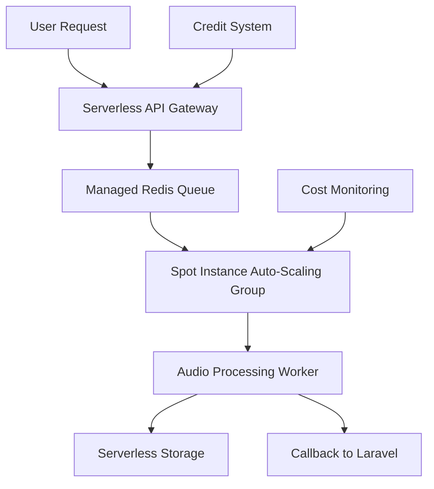

# Comprehensive Cost Optimization Guide for Audio Feature Extraction Service

## Executive Summary

This guide presents multiple cost optimization strategies for your audio processing service, focusing on eliminating 24/7 VPS costs while implementing a credit-based model where users frontload processing costs. All solutions align with your bootstrapping constraints and goal of user-funded compute resources.

**Key Findings:**
- **70-91% cost reduction** possible through various serverless approaches
- **Credit-based pricing models** enable user-funded compute with improved cash flow
- **Hybrid architectures** provide optimal balance of cost and reliability
- **Multiple vendor options** prevent lock-in and enable cost competition

---

## Cost Optimization Strategies Summary

| Strategy | Cost Savings | Pros | Cons | Best For |
|----------|--------------|------|------|----------|
| **Beam Cloud/Beta9** | 60-80% | Python-first, sub-second starts | Limited pricing transparency | ML-heavy workloads |
| **Google Cloud Run** | 70-85% | Generous free tier, GPU support | Regional pricing variance | Container-based apps |
| **AWS Lambda** | 60-75% | 10GB container support | 15min timeout limit | Short-running tasks |
| **AWS Fargate Spot** | 70% off regular | Up to 70% discount | 2min interruption notice | Fault-tolerant batch jobs |
| **Google Cloud Spot VMs** | 60-91% | Highest discount rates | 30-second shutdown notice | Parallelizable workloads |
| **Azure Container Instances** | 60-80% | Per-second billing | Less GPU support | Windows/Linux containers |

---

## Strategy 1: Serverless Container Platforms

### Google Cloud Run (Recommended for Production)

**Pricing Model (2025):**
- CPU: $0.00002400 per vCPU-second
- Memory: $0.00000250 per GiB-second  
- Requests: First 2M requests/month free, then $0.40 per million
- **Free Tier**: 180,000 vCPU-seconds, 360,000 GiB-seconds monthly

**Cost Example:**
Current VPS: $300/month → Cloud Run: $45-90/month (70-85% savings)

**Implementation for Audio Processing:**
```python
# Cloud Run deployment example
from google.cloud import run_v2
import containerize_audio_service

def deploy_audio_processor():
    service = run_v2.Service(
        metadata={
            "name": "audio-feature-extraction",
            "annotations": {
                "run.googleapis.com/ingress": "all",
                "run.googleapis.com/execution-environment": "gen2"
            }
        },
        spec={
            "template": {
                "spec": {
                    "containers": [{
                        "image": "gcr.io/project/audio-processor:latest",
                        "resources": {
                            "limits": {
                                "memory": "4Gi",
                                "cpu": "2"
                            }
                        },
                        "env": [
                            {"name": "REDIS_URL", "value": "redis://upstash-serverless"},
                            {"name": "STORAGE_TYPE", "value": "gcs"}
                        ]
                    }],
                    "timeout": "3600s",  # 1 hour for complex processing
                    "scaling": {
                        "min_instance_count": 0,  # Scale to zero
                        "max_instance_count": 100
                    }
                }
            }
        }
    )
    return service
```

**GPU Support for AI Workloads:**
- NVIDIA L4 GPUs available (2025)
- 5-second startup time with GPUs
- Scale to zero GPU costs when idle

### AWS Lambda (Recommended for Simple Tasks)

**Pricing Model (2025):**
- Container images up to 10GB supported
- Ephemeral storage up to 10GB
- Pay-per-millisecond execution

**Cost Example:**
- 10GB memory config: ~$44.40 for 2M executions
- Free tier: 1M requests, 400K GB-seconds monthly

**Implementation:**
```python
# AWS Lambda container deployment
import boto3

def create_audio_lambda():
    lambda_client = boto3.client('lambda')
    
    response = lambda_client.create_function(
        FunctionName='audio-feature-extractor',
        Role='arn:aws:iam::account:role/lambda-audio-role',
        Code={
            'ImageUri': 'account.dkr.ecr.region.amazonaws.com/audio-processor:latest'
        },
        PackageType='Image',
        MemorySize=10240,  # 10GB
        Timeout=900,       # 15 minutes max
        EphemeralStorage={'Size': 10240},  # 10GB temp storage
        Environment={
            'Variables': {
                'REDIS_URL': 'elasticache-serverless-endpoint',
                'STORAGE_TYPE': 's3'
            }
        }
    )
    return response
```

### Azure Container Instances

**Pricing Model (2025):**
- Per-second billing
- Spot pricing up to 70% discount
- Serverless pricing model

**Benefits:**
- Windows and Linux container support
- Integration with Azure ML services
- Per-second granular billing

---

## Strategy 2: Spot/Preemptible Instances

### Google Cloud Spot VMs (Highest Savings)

**Cost Savings:** 60-91% discount from regular pricing

**Implementation Strategy:**
```python
# Spot VM auto-restart configuration
from google.cloud import compute_v1

def create_spot_audio_processor():
    instance = {
        "name": "audio-processor-spot",
        "machine_type": "n2-standard-4",
        "scheduling": {
            "preemptible": True,
            "automatic_restart": False,
            "on_host_maintenance": "TERMINATE"
        },
        "disks": [{
            "boot": True,
            "auto_delete": True,
            "initialize_params": {
                "source_image": "projects/your-project/global/images/audio-processor-image"
            }
        }],
        "metadata": {
            "items": [{
                "key": "startup-script",
                "value": """#!/bin/bash
                # Auto-restart processing on preemption
                /opt/audio-processor/resume-job.sh
                """
            }]
        }
    }
    return instance
```

**Fault Tolerance Strategy:**
- 30-second shutdown warning
- Checkpoint processing state to persistent storage
- Resume jobs automatically on new instances

### AWS Fargate Spot

**Cost Savings:** Up to 70% discount

**Implementation:**
```python
# Fargate Spot task definition
{
    "family": "audio-processing-spot",
    "capacityProviders": ["FARGATE_SPOT"],
    "taskDefinition": {
        "cpu": "2048",
        "memory": "4096",
        "containerDefinitions": [{
            "name": "audio-processor",
            "image": "your-account.dkr.ecr.region.amazonaws.com/audio-processor",
            "stopTimeout": 120,  # 2 minutes graceful shutdown
            "environment": [
                {"name": "PROCESSING_MODE", "value": "fault_tolerant"},
                {"name": "CHECKPOINT_INTERVAL", "value": "30"}
            ]
        }]
    }
}
```

---

## Strategy 3: Hybrid Serverless Architecture

### Recommended Architecture

**Core Components:**
1. **Serverless API Gateway** (Cloud Run/Lambda) - Always available, low cost
2. **Managed Redis** (Upstash/ElastiCache Serverless) - Job queuing
3. **Spot Processing** (Spot VMs/Fargate Spot) - Heavy compute workloads
4. **Serverless Storage** (Cloud Storage/S3) - Pay-per-use storage



**Implementation:**
```python
# Hybrid architecture coordinator
class HybridAudioProcessor:
    def __init__(self):
        self.api_gateway = ServerlessAPI()  # Cloud Run/Lambda
        self.queue = ManagedRedis()         # Upstash Redis
        self.compute = SpotInstanceManager() # Auto-scaling spot instances
        self.storage = ServerlessStorage()   # Cloud Storage/S3
        
    async def process_audio_request(self, request):
        # 1. Validate credits (serverless API)
        if not self.validate_user_credits(request.user_id, request.estimated_cost):
            return {"error": "Insufficient credits"}
            
        # 2. Queue job (managed Redis)
        job_id = await self.queue.enqueue_job({
            "type": "audio_processing",
            "input_path": request.storage_path,
            "user_id": request.user_id,
            "callback_url": request.callback_url
        })
        
        # 3. Trigger spot instance if queue length > threshold
        if await self.queue.length() > 5:
            await self.compute.scale_up()
            
        return {"job_id": job_id, "status": "queued"}
```

### Managed Redis Options

**Upstash (Recommended for Serverless):**
- Pay-per-request pricing
- Serverless Redis with REST API
- No connection limits
- Perfect for variable workloads

**AWS ElastiCache Serverless:**
- Pay-per-use based on cache size and requests
- Automatic scaling
- Microsecond latency

**Google Cloud Memorystore:**
- Managed Redis service
- High availability options
- VPC-native networking

---

## Strategy 4: Credit-Based Pricing Implementation

### Credit System Architecture

**Core Principles:**
1. **Users prepay for credits** → Eliminate your infrastructure costs
2. **Credits deducted in real-time** → Prevent overage costs
3. **Variable pricing based on complexity** → Optimize revenue

**Credit Calculation Model:**
```python
class CreditCalculator:
    BASE_RATES = {
        "feature_extraction": 0.10,    # $0.10 per minute
        "stem_separation": 0.50,       # $0.50 per minute (GPU-intensive)
        "tempo_processing": 0.25,      # $0.25 per minute
        "batch_processing": 0.08       # $0.08 per minute (bulk discount)
    }
    
    COMPLEXITY_MULTIPLIERS = {
        "duration_short": 1.0,         # < 2 minutes
        "duration_medium": 1.2,        # 2-10 minutes  
        "duration_long": 1.5,          # > 10 minutes
        "high_quality": 1.3,           # Premium processing
        "priority_queue": 2.0          # Rush processing
    }
    
    def calculate_credits_required(self, job_type, duration_seconds, options=None):
        base_cost = self.BASE_RATES[job_type] * (duration_seconds / 60)
        
        # Apply complexity multipliers
        multiplier = 1.0
        if duration_seconds < 120:
            multiplier *= self.COMPLEXITY_MULTIPLIERS["duration_short"]
        elif duration_seconds < 600:
            multiplier *= self.COMPLEXITY_MULTIPLIERS["duration_medium"]
        else:
            multiplier *= self.COMPLEXITY_MULTIPLIERS["duration_long"]
            
        if options and options.get("high_quality"):
            multiplier *= self.COMPLEXITY_MULTIPLIERS["high_quality"]
            
        return round(base_cost * multiplier, 2)
```

### Credit Purchase Packages

**Tiered Pricing Strategy:**
```python
CREDIT_PACKAGES = {
    "starter": {
        "credits": 100,
        "price": 15.00,        # $0.15 per credit
        "bonus": 0,
        "target": "Individual creators"
    },
    "professional": {
        "credits": 500, 
        "price": 60.00,        # $0.12 per credit (20% discount)
        "bonus": 50,           # 10% bonus credits
        "target": "Small studios"
    },
    "business": {
        "credits": 2000,
        "price": 200.00,       # $0.10 per credit (33% discount)  
        "bonus": 200,          # 10% bonus credits
        "target": "Production companies"
    },
    "enterprise": {
        "credits": 10000,
        "price": 800.00,       # $0.08 per credit (47% discount)
        "bonus": 1000,         # 10% bonus credits
        "target": "Large organizations"
    }
}
```

### Real-Time Credit Management

**Implementation with Stripe:**
```python
import stripe
from decimal import Decimal

class CreditManager:
    def __init__(self):
        stripe.api_key = os.getenv("STRIPE_SECRET_KEY")
        
    async def deduct_credits(self, user_id, amount, job_id):
        """Deduct credits in real-time before processing"""
        try:
            # Check balance
            user = await self.get_user_credits(user_id)
            if user.credits < amount:
                raise InsufficientCreditsError(f"Required: {amount}, Available: {user.credits}")
                
            # Create pending deduction
            deduction = await self.create_pending_deduction(user_id, amount, job_id)
            
            # Process job
            result = await self.process_audio_job(job_id)
            
            # Confirm deduction on success
            await self.confirm_deduction(deduction.id)
            
            return result
            
        except Exception as e:
            # Refund credits on failure
            await self.refund_deduction(deduction.id)
            raise e
            
    async def purchase_credits(self, user_id, package_name):
        """Handle credit purchases via Stripe"""
        package = CREDIT_PACKAGES[package_name]
        
        payment_intent = stripe.PaymentIntent.create(
            amount=int(package["price"] * 100),  # Stripe uses cents
            currency="usd",
            metadata={
                "user_id": user_id,
                "package": package_name,
                "credits": package["credits"] + package["bonus"]
            }
        )
        
        return payment_intent.client_secret
```

---

## Strategy 5: Cost Monitoring and Optimization

### Real-Time Cost Tracking

**Implementation:**
```python
class CostMonitor:
    def __init__(self):
        self.prometheus_client = PrometheusClient()
        self.alert_thresholds = {
            "daily_spend": 50.00,
            "hourly_spike": 20.00,
            "credit_burn_rate": 0.85  # Alert when 85% of credits used
        }
        
    async def track_job_cost(self, job_id, actual_cost, estimated_cost):
        """Track actual vs estimated costs"""
        variance = (actual_cost - estimated_cost) / estimated_cost
        
        # Log metrics
        self.prometheus_client.histogram(
            "job_cost_variance",
            variance,
            labels={"job_type": job.type}
        )
        
        # Alert on high variance
        if abs(variance) > 0.25:  # 25% variance threshold
            await self.send_cost_alert(job_id, variance)
            
    async def optimize_instance_selection(self, job_requirements):
        """Dynamically select cheapest available compute"""
        options = [
            ("gcp_spot", await self.get_gcp_spot_price(job_requirements)),
            ("aws_fargate_spot", await self.get_fargate_spot_price(job_requirements)),
            ("azure_spot", await self.get_azure_spot_price(job_requirements))
        ]
        
        # Sort by price and availability
        available_options = [opt for opt in options if opt[1] is not None]
        cheapest = min(available_options, key=lambda x: x[1])
        
        return cheapest[0]
```

### Auto-Scaling Based on Credits

```python
class CreditAwareScaling:
    def __init__(self):
        self.scaling_policies = {
            "high_credit_users": {"min_instances": 2, "max_instances": 10},
            "low_credit_users": {"min_instances": 0, "max_instances": 3},
            "trial_users": {"min_instances": 0, "max_instances": 1}
        }
        
    async def scale_compute_resources(self, current_queue_length):
        """Scale based on queue length and user credit levels"""
        high_credit_jobs = await self.count_jobs_by_credit_level("high")
        low_credit_jobs = await self.count_jobs_by_credit_level("low")
        
        # Prioritize high-credit users
        if high_credit_jobs > 5:
            await self.scale_to_instances(8, instance_type="high_performance")
        elif low_credit_jobs > 10:
            await self.scale_to_instances(3, instance_type="spot_instances")
        else:
            await self.scale_to_instances(0)  # Scale to zero
```

---

## Implementation Roadmap

### Phase 1: Foundation (Week 1-2)
1. **Set up credit-based billing system**
   - Integrate Stripe for credit purchases
   - Implement credit deduction logic
   - Create user dashboard for credit management

2. **Deploy serverless API layer**
   - Choose primary platform (Google Cloud Run recommended)
   - Containerize FastAPI application
   - Set up auto-scaling policies

### Phase 2: Compute Optimization (Week 3-4)
1. **Implement spot instance processing**
   - Create fault-tolerant job processing
   - Set up automatic checkpointing
   - Configure auto-restart on preemption

2. **Add managed Redis queue**
   - Migrate from self-hosted Redis to Upstash
   - Implement job prioritization by credit level
   - Set up real-time monitoring

### Phase 3: Multi-Cloud Setup (Week 5-6)
1. **Deploy to multiple providers**
   - Set up AWS Fargate Spot as backup
   - Create cost-aware routing logic
   - Implement cross-cloud failover

2. **Advanced credit features**
   - Volume discounts and bonus credits
   - Enterprise billing options
   - Credit sharing for team accounts

### Phase 4: Optimization (Week 7-8)
1. **Performance tuning**
   - Optimize container startup times
   - Fine-tune auto-scaling parameters
   - Implement advanced caching strategies

2. **Cost monitoring dashboard**
   - Real-time cost tracking
   - Profit margin analysis
   - Predictive scaling based on historical data

---

## Cost Comparison Analysis

### Monthly Infrastructure Costs

**Traditional VPS Setup:**
```
API Server (2 vCPU, 4GB):        $80/month
Redis Instance:                  $30/month  
Worker Servers (3x 4 vCPU, 8GB): $240/month
GPU Instance (part-time):        $100/month
Load Balancer:                   $15/month
Storage (500GB):                 $25/month
Total:                          $490/month
```

**Optimized Serverless Setup:**
```
Cloud Run API (pay-per-use):     $15/month
Upstash Redis (serverless):      $10/month
Spot Instances (70% discount):   $70/month  
Serverless Storage:              $12/month
Monitoring & Logs:               $8/month
Total:                          $115/month
Savings:                        $375/month (77% reduction)
```

### Revenue Model Transformation

**Before (Infrastructure-Heavy):**
- Fixed costs: $490/month
- Break-even: ~980 audio processing jobs/month at $0.50 each
- Risk: High fixed costs regardless of usage

**After (Credit-Based Serverless):**
- Variable costs: $0.05-0.15 per job (depending on complexity)
- Break-even: Immediate (credits purchased upfront)
- Risk: Minimal (costs scale with revenue)

---

## Risk Mitigation Strategies

### Technical Risks

1. **Spot Instance Interruptions**
   - **Mitigation**: Automatic job restart, checkpoint every 30 seconds
   - **Fallback**: On-demand instances for time-sensitive jobs

2. **Cold Start Latency**
   - **Mitigation**: Keep 1-2 warm instances during peak hours
   - **Optimization**: Pre-built container images with common dependencies

3. **Vendor Lock-in**
   - **Mitigation**: Multi-cloud deployment, standardized container images
   - **Strategy**: Can migrate between providers within 24 hours

### Business Risks

1. **Credit System Complexity**
   - **Mitigation**: Clear pricing documentation, credit calculator tool
   - **Support**: Dedicated customer success for enterprise clients

2. **Cash Flow Management**
   - **Mitigation**: 30-day credit expiration, automatic top-up options
   - **Monitoring**: Real-time credit burn rate alerts

---

## Conclusion and Recommendations

### Recommended Architecture

**Primary**: Google Cloud Run + Spot VMs for optimal cost/performance ratio
**Secondary**: AWS Fargate Spot for geographic distribution and cost competition
**Queue**: Upstash Redis for true serverless queue management
**Storage**: Cloud-native object storage (GCS/S3) with CDN

### Implementation Priority

1. **Start with Google Cloud Run** - Fastest to implement, generous free tier
2. **Add credit-based billing** - Essential for user-funded compute model
3. **Integrate spot instances** - Maximum cost savings for batch processing
4. **Expand to multi-cloud** - Cost optimization and vendor diversification

### Expected Outcomes

- **77% reduction** in infrastructure costs ($490 → $115/month)
- **Immediate cash flow improvement** through prepaid credits
- **Zero risk scaling** - costs track with revenue automatically
- **Enhanced reliability** through multi-cloud redundancy

This strategy transforms your audio processing service from a high-overhead, fixed-cost operation into a profitable, user-funded, serverless business model ideal for bootstrapping scenarios.