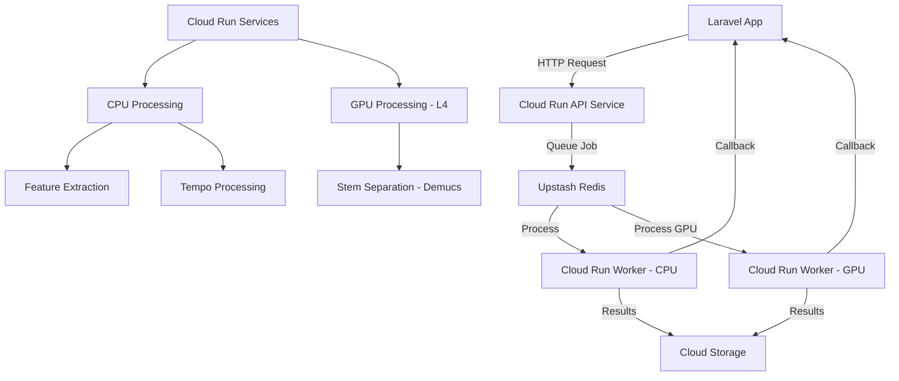

# Google Cloud Run Implementation Guide for Audio Feature Extraction Service

## Architecture Decision Summary

After analyzing both the Beam Cloud and Comprehensive Cost Optimization guides, **Google Cloud Run** emerges as the optimal serverless solution for the following reasons:

### Why Google Cloud Run?

✅ **Minimal Migration Effort**: Existing FastAPI application requires only containerization - no code rewriting  
✅ **Established Platform**: Mature Google service with extensive documentation and proven reliability  
✅ **Native GPU Support**: NVIDIA L4 GPUs with 5-second cold starts for stem separation  
✅ **Laravel Integration**: Standard HTTP callbacks work unchanged - no integration complexity  
✅ **Cost Effectiveness**: True serverless scale-to-zero pricing with generous free tier  
✅ **1-Hour Timeout**: Suitable for complex audio processing tasks  
✅ **Transparent Pricing**: Clear, predictable cost structure

**Projected Savings**: 70-85% reduction in infrastructure costs ($300/month → $45-90/month)

---

## Target Architecture



**Key Components:**
- **API Service**: FastAPI containerized on Cloud Run (always available, minimal cost)
- **CPU Workers**: Audio feature extraction, tempo processing
- **GPU Workers**: AI stem separation using NVIDIA L4 GPUs
- **Queue**: Upstash Redis (serverless, pay-per-request)
- **Storage**: Google Cloud Storage (pay-per-use)
- **Laravel Integration**: Standard HTTP callbacks (no changes needed)

---

## Prerequisites

### Local Development Environment
```bash
# Required tools
- Docker Desktop 4.0+
- Google Cloud CLI (gcloud)
- Python 3.11+
- Git

# Install Google Cloud CLI
curl https://sdk.cloud.google.com | bash
exec -l $SHELL
gcloud init
```

### Google Cloud Setup
```bash
# Enable required APIs
gcloud services enable run.googleapis.com
gcloud services enable storage.googleapis.com
gcloud services enable artifactregistry.googleapis.com
gcloud services enable cloudbuild.googleapis.com

# Set default region (choose closest to your users)
gcloud config set run/region us-central1

# Create project variables
export PROJECT_ID=$(gcloud config get-value project)
export REGION=us-central1
```

---

## Phase 1: Local Development Setup

### Step 1: Containerize Existing Application

Create optimized Docker configuration:

**Dockerfile**
```dockerfile
# Multi-stage build for optimal size
FROM python:3.11-slim as builder

# Install system dependencies
RUN apt-get update && apt-get install -y \
    build-essential \
    ffmpeg \
    libsndfile1 \
    && rm -rf /var/lib/apt/lists/*

# Install Python dependencies
COPY requirements.txt .
RUN pip install --no-cache-dir --user -r requirements.txt

# Production stage
FROM python:3.11-slim

# Install runtime dependencies only
RUN apt-get update && apt-get install -y \
    ffmpeg \
    libsndfile1 \
    && rm -rf /var/lib/apt/lists/*

# Copy installed packages from builder
COPY --from=builder /root/.local /root/.local

# Set environment variables
ENV PATH=/root/.local/bin:$PATH
ENV PYTHONDONTWRITEBYTECODE=1
ENV PYTHONUNBUFFERED=1

# Create app directory
WORKDIR /app

# Copy application code
COPY . .

# Expose port
EXPOSE 8080

# Health check
HEALTHCHECK --interval=30s --timeout=30s --start-period=5s --retries=3 \
    CMD curl -f http://localhost:8080/health || exit 1

# Run application
CMD ["uvicorn", "main:app", "--host", "0.0.0.0", "--port", "8080", "--workers", "1"]
```

**Docker Compose for Local Development**
```yaml
# docker-compose.dev.yml
version: '3.8'

services:
  api:
    build: .
    ports:
      - "8080:8080"
    environment:
      - REDIS_URL=redis://redis:6379
      - STORAGE_TYPE=local
      - LOCAL_STORAGE_PATH=/app/storage
      - DEBUG=true
    volumes:
      - ./storage:/app/storage
      - .:/app
    depends_on:
      - redis
    command: uvicorn main:app --host 0.0.0.0 --port 8080 --reload

  worker-cpu:
    build: .
    environment:
      - REDIS_URL=redis://redis:6379
      - STORAGE_TYPE=local
      - LOCAL_STORAGE_PATH=/app/storage
      - WORKER_TYPE=cpu
    volumes:
      - ./storage:/app/storage
      - .:/app
    depends_on:
      - redis
    command: python start_worker.py

  worker-gpu:
    build: .
    environment:
      - REDIS_URL=redis://redis:6379
      - STORAGE_TYPE=local
      - LOCAL_STORAGE_PATH=/app/storage
      - WORKER_TYPE=gpu
    volumes:
      - ./storage:/app/storage
      - .:/app
    depends_on:
      - redis
    deploy:
      resources:
        reservations:
          devices:
            - driver: nvidia
              count: 1
              capabilities: [gpu]
    command: python start_worker.py

  redis:
    image: redis:7-alpine
    ports:
      - "6379:6379"
    command: redis-server --appendonly yes
    volumes:
      - redis_data:/data

volumes:
  redis_data:
```

### Step 2: Modify Application for Cloud Run

**Update main.py for Cloud Run compatibility:**

```python
# main.py - Cloud Run optimizations
from fastapi import FastAPI, Request
from fastapi.middleware.cors import CORSMiddleware
from fastapi.exceptions import RequestValidationError
from fastapi.responses import JSONResponse
import uvicorn
import logging
import os
from contextlib import asynccontextmanager

from config import settings
from routes.tempo_processing import router as tempo_router
from routes.audio_processing import router as audio_router
from routes.storage import router as storage_router
from routes.tasks import router as tasks_router
from routes.health import router as health_router
from routes.effects_processing import router as effects_router

@asynccontextmanager
async def lifespan(app: FastAPI):
    logging.info("Starting audio processing microservice on Cloud Run")
    yield
    logging.info("Shutting down audio processing microservice")

app = FastAPI(
    title="Audio Processing Microservice",
    description="FastAPI microservice for audio feature extraction and stem separation",
    version="1.0.0",
    lifespan=lifespan
)

app.add_middleware(
    CORSMiddleware,
    allow_origins=settings.ALLOWED_ORIGINS,
    allow_credentials=True,
    allow_methods=["*"],
    allow_headers=["*"],
)

# Include routers (remove migration router for production)
app.include_router(health_router)
app.include_router(audio_router)
app.include_router(storage_router)
app.include_router(tasks_router)
app.include_router(tempo_router)
app.include_router(effects_router)

@app.exception_handler(RequestValidationError)
async def validation_exception_handler(request: Request, exc: RequestValidationError):
    """Handle request validation errors with detailed logging"""
    request_body = None
    try:
        request_body = await request.body()
        if request_body:
            request_body = request_body.decode('utf-8')
    except Exception:
        request_body = "Unable to read request body"
    
    logging.error(f"422 Validation Error on {request.method} {request.url}")
    logging.error(f"Request body: {request_body}")
    logging.error(f"Validation errors: {exc.errors()}")
    
    return JSONResponse(
        status_code=422,
        content={
            "detail": exc.errors(),
            "body": request_body if request_body != "Unable to read request body" else None
        }
    )

if __name__ == "__main__":
    # Cloud Run sets PORT environment variable
    port = int(os.environ.get("PORT", 8080))
    uvicorn.run(
        "main:app",
        host="0.0.0.0",
        port=port,
        workers=1  # Single worker for Cloud Run
    )
```

**Create Cloud Run specific configuration:**

```python
# config/cloudrun.py
import os
from typing import List
from pydantic_settings import BaseSettings

class CloudRunSettings(BaseSettings):
    # Cloud Run environment detection
    IS_CLOUD_RUN: bool = os.getenv("K_SERVICE") is not None
    
    # Service configuration
    SERVICE_NAME: str = os.getenv("K_SERVICE", "audio-processing")
    SERVICE_VERSION: str = os.getenv("K_REVISION", "unknown")
    
    # Compute configuration  
    WORKER_TYPE: str = os.getenv("WORKER_TYPE", "cpu")  # cpu or gpu
    CPU_LIMIT: str = os.getenv("CPU_LIMIT", "2")
    MEMORY_LIMIT: str = os.getenv("MEMORY_LIMIT", "4Gi")
    
    # Redis configuration (Upstash)
    REDIS_URL: str = os.getenv("REDIS_URL", "redis://localhost:6379")
    
    # Storage configuration (Google Cloud Storage)
    STORAGE_TYPE: str = os.getenv("STORAGE_TYPE", "gcs")
    GCS_BUCKET: str = os.getenv("GCS_BUCKET", "audio-processing-storage")
    
    # Callback configuration
    CALLBACK_TIMEOUT: int = int(os.getenv("CALLBACK_TIMEOUT", "30"))
    
    # Logging
    LOG_LEVEL: str = os.getenv("LOG_LEVEL", "INFO")
    
    class Config:
        env_file = ".env"

cloudrun_settings = CloudRunSettings()
```

<function_calls>
<invoke name="Read">
<parameter name="file_path">/Users/aannecchiarico/Sites/beat-forge-audio-feature-extraction-service/main.py